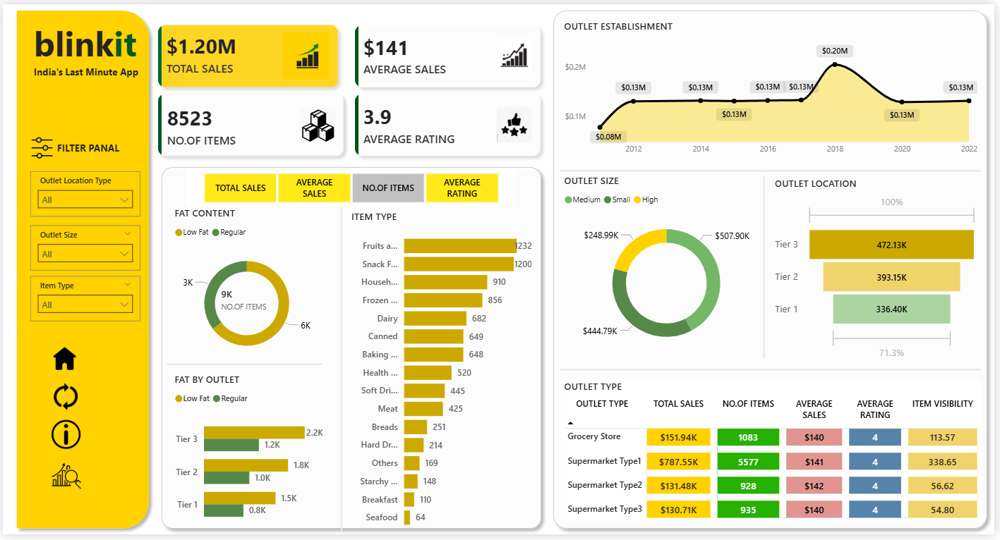

Blinkit Sales Analysis Dashboard (Power BI):-

->Overview:

This project presents a comprehensive analysis of Blinkit's sales performance, customer satisfaction, and inventory distribution using Power BI.
The dashboard provides actionable insights through interactive visualizations and key performance indicators (KPIs).

->Business Objective:
To analyze and optimize:
* Sales performance
* Customer ratings
* Product distribution
* Outlet-level trends

Using data-driven insights and visualization techniques.

->Key KPIs:
* "Total Sales" – Overall revenue generated
* "Average Sales" – Revenue per transaction
* "Number of Items" – Total items sold
* "Average Rating" – Customer satisfaction metric

->Tools & Technologies

* Power BI (Dashboard & Visualization)
* DAX (Calculated Measures)
* Data Modeling
* Data Cleaning & Transformation
* Excel / CSV

->Dashboard Preview:

]

->Key Insights:
* Tier 3 outlets contribute the highest revenue
* Large-size outlets dominate total sales
* Fruits and snack foods are top-performing categories
* Sales peaked around outlet establishments from 2018
* Customer ratings remain consistent across outlet types

->Project Structure:
blinkit-sales-analysis-powerbi
│
├── Dashboard
│   └── Blinkit_Dashboard.pbix
│
├── Data
│   └── dataset.csv
│
├── Images
│   └── dashboard.png
│
├── Docs
│   └── Business_Statement.pdf
│
└── README.md

->Documentation:

Detailed business requirements, KPIs, and chart explanations are available here:
->Docs/Business_Statement.pdf

->How to Use:

1. Download the `.pbix` file from the Dashboard folder
2. Open using Power BI Desktop
3. Explore filters and visuals interactively

->Use Case:

This project demonstrates practical skills required for:
* Data Analyst
* Business Analyst
* Reporting Analyst
* Power BI Developer roles

->Contact:

Name: Menavath Pavan Kumar

Email: [mpavankumar.17072006@gmail.com](mailto:mpavankumar.17072006@gmail.com)

⭐ If you found this useful

Give this repo a star ⭐ and feel free to connect!

